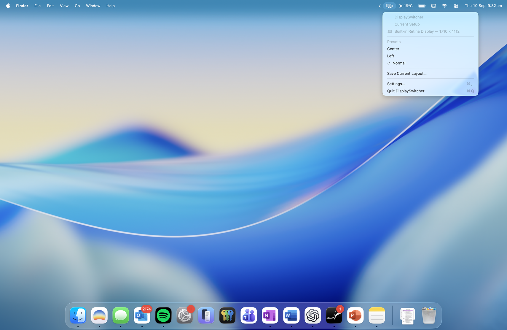
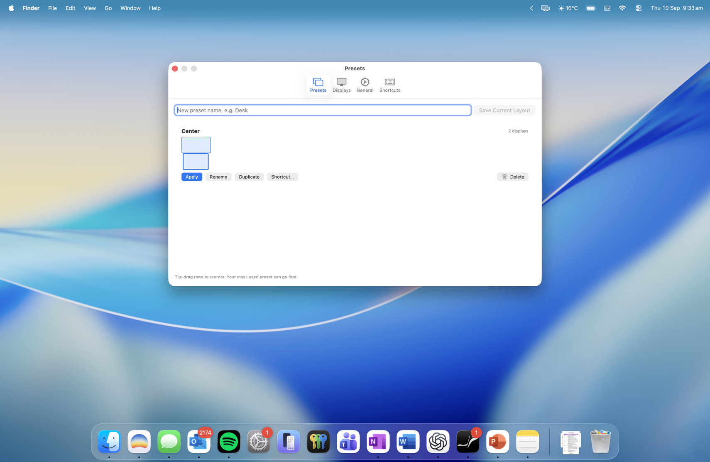

# DisplaySwitcher

A lightweight native macOS menu-bar utility to save multi-monitor display arrangements as named presets and switch between them with one click.

## Features

* Save display arrangements as named presets
* One-click switching from the menu bar
* Global keyboard shortcuts (per preset, next/previous)
* Multi-monitor support (3+ displays, portrait, mixed resolutions/scaling)
* MacBook built-in + external display support
* Current-preset recognition with checkmark in the menu
* Optional restore-last-preset-on-reconnect (off by default)
* Launch at login
* Fully local — no account, analytics, telemetry, or cloud
* Open source (MIT)

## Screenshots

| Menu Bar | Settings — Presets |
|---|---|
|  |  |

## Requirements

* macOS 14 Sonoma or newer
* Apple Silicon or Intel Mac
* No special permissions required (no Screen Recording, Accessibility, Files, Contacts, Camera, or Microphone)

### Limitations

* **Main display:** macOS offers no public API to designate the main display (the one with the menu bar). DisplaySwitcher repositions every display exactly as saved and keeps the saved main display's position stable, so the relative arrangement is always correct — but if macOS itself moves the menu bar to a different screen, set it once via System Settings → Displays (drag the menu bar). The saved `wasMain` flag is preserved in every preset for when Apple provides an API.
* **Display modes:** presets capture resolution/refresh/mode IDs for matching context. Applying a preset repositions displays; it does not force resolution or refresh-rate changes, because forcing modes can leave a display in an unusable state. Mode support may be extended carefully in the future.
* **Gaps/overlaps:** Quartz (`CGConfigureDisplayOrigin`) documents that it nudges requested origins to remove gaps or overlaps when committing. DisplaySwitcher validates for overlaps before applying, but macOS may still adjust edge-touching layouts slightly.
* **Mirroring:** mirrored sets are detected and reported; presets do not change mirroring state.

## Installation

### Quick install (recommended)

Requires macOS 14+ and Xcode (or its Command Line Tools). One command builds
DisplaySwitcher, copies it into `/Applications`, and launches it:

```bash
git clone https://github.com/Browny01/DisplaySwitcher.git
cd DisplaySwitcher
./install.sh
```

...or with the included Makefile: `make install`.

The app appears in your Applications folder and lives in the menu bar
(click the two-displays icon). To remove it: `./uninstall.sh` (your saved
presets are kept). Re-run `./install.sh` any time to get the latest build.

### Build from source in Xcode

```bash
git clone https://github.com/Browny01/DisplaySwitcher.git
cd DisplaySwitcher
open DisplaySwitcher.xcodeproj
```

Then in Xcode: select the **DisplaySwitcher** scheme, choose **My Mac**, and press **⌘R** to build and run. No Swift package dependencies — there is nothing to resolve.

Command line:

```bash
make build   # build only
```

## Usage

1. Arrange your displays in macOS System Settings → Displays.
2. Click the DisplaySwitcher menu-bar icon (two displays glyph).
3. Choose **Save Current Layout**, give it a name (e.g. `Desk`).
4. Rearrange your displays, save another preset (e.g. `Gaming`).
5. Switch between them from the menu bar — the active one gets a checkmark.
6. Optionally assign global shortcuts in Settings → Shortcuts / Presets.

## How it works

* **Detection** (`Services/DisplayDiscovery.swift`): enumerates online displays with `CGGetOnlineDisplayList` and enriches each with `CGDisplayBounds`, `CGDisplayVendorNumber`/`ModelNumber`/`SerialNumber`, `CGDisplayScreenSize`, rotation, mode/refresh, and `NSScreen.localizedName` + scale.
* **Matching** (`Services/DisplayMatcher.swift`): `CGDirectDisplayID`s are session-local, so each display is fingerprinted from vendor/product/serial IDs, physical size, built-in flag, and name. Candidates are scored with weights favouring stable hardware identifiers; ambiguous pairs are left unmatched rather than guessed.
* **Switching** (`Services/DisplayConfigurationService.swift`): the preset is validated (complete unambiguous mapping, no overlapping targets), relative offsets are re-anchored so the saved main display stays put, and origins are committed in a single `CGBeginDisplayConfiguration` → `CGConfigureDisplayOrigin` → `CGCompleteDisplayConfiguration(permanently)` transaction. Origins are snapshotted first so a failure restores the previous layout best-effort.
* **Persistence**: presets live as versioned JSON (`presets.json`) in Application Support; settings live in UserDefaults.
* **Shortcuts**: Carbon `RegisterEventHotKey` — global, no Accessibility permission, no dependencies. Recorded shortcuts require ≥2 modifiers.
* **Login item**: `SMAppService.mainApp` (macOS 13+; needs a signed build to take effect).
* **Reconnects**: `CGDisplayRegisterReconfigurationCallback` refreshes the menu and re-runs matching. Layouts are never changed automatically unless *Restore last preset when its displays reconnect* is explicitly enabled.

## macOS display API notes

* `CGBeginDisplayConfiguration` / `CGConfigureDisplayOrigin` / `CGConfigureDisplayWithDisplayMode` / `CGCompleteDisplayConfiguration` are **not deprecated** — they remain the supported programmatic path for repositioning displays. All Quartz calls are isolated behind `DisplayConfigurationService` so a future API can be swapped in.
* `CGConfigureDisplayMode` (dictionary-based) and `CGDisplayIOServicePort` **are** deprecated and are not used.
* There is no public API for setting the main display or for a persistent display UUID — both limitations are documented above and handled by design (fingerprint matching, anchor-stable planning).

## Privacy

* No account
* No analytics or telemetry
* No cloud sync
* No external servers
* Display configuration never leaves your Mac

## Contributing

Bug reports and pull requests are welcome.

## License

MIT — see [LICENSE](LICENSE).

## Roadmap

* Automatic per-setup switching ("when these monitors connect, apply this preset")
* Location/dock-based profiles
* Careful display-mode (resolution/refresh) support
* Import/export presets
* Optional iCloud preset sync
* Shortcuts.app (App Intents) support
* CLI companion
* Homebrew Cask distribution
* Signed + notarized GitHub Releases
* Multi-space/workspace helpers where macOS permits
